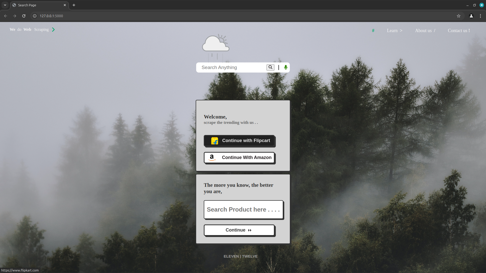
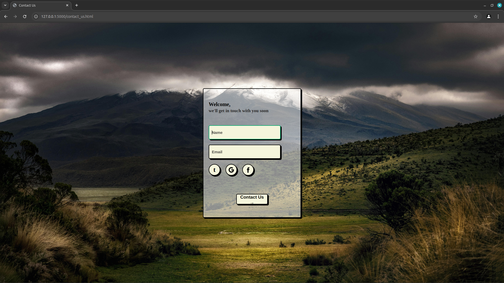
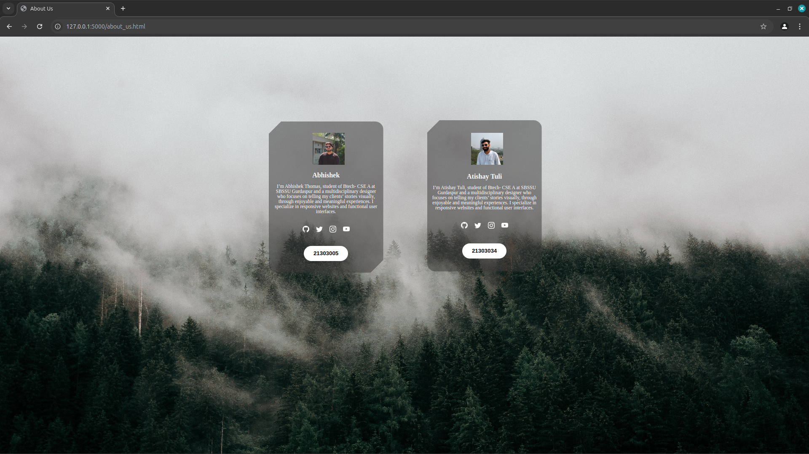
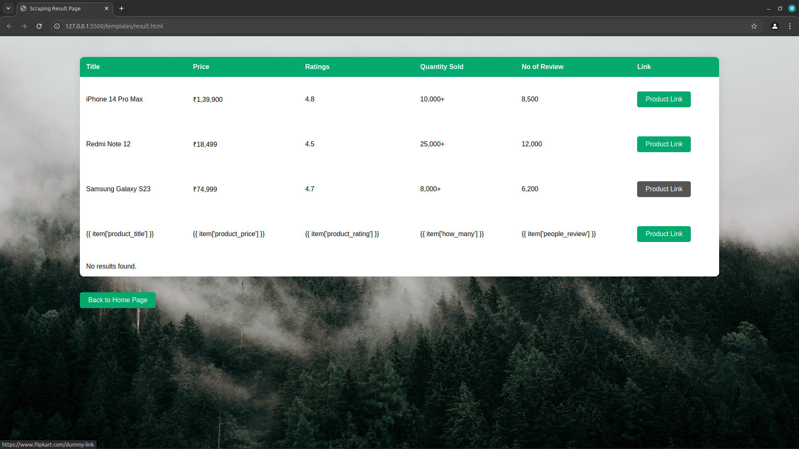
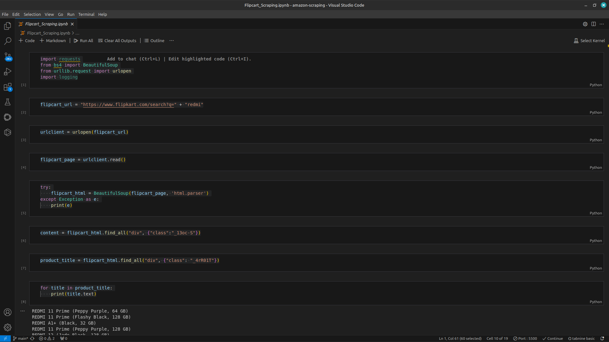
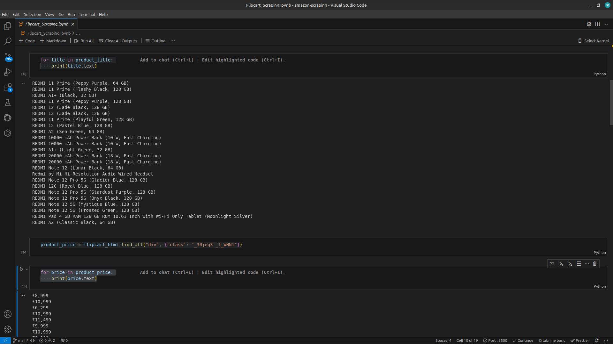
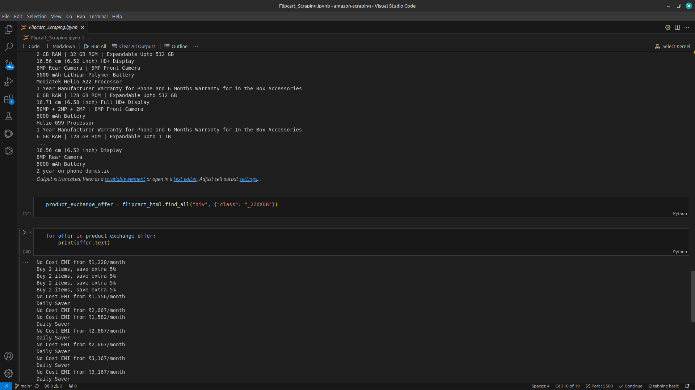

# Flipkart & Amazon Web Scraping Tool 🛒

## Description

The Flipkart & Amazon Web Scraping Tool is a web application built with HTML, CSS, JavaScript, and Python (using Flask). It allows users to search for products based on keywords and scrape product details such as title, price, ratings, number of reviews, and purchase links from Flipkart and Amazon.

This tool is ideal for e-commerce researchers, developers, or anyone looking to compare prices, product features, or gather insights from online retailers.

## Features

- Product Search: Users can search for products by entering keywords.
- Product Details: Retrieves and displays product information including:

    Title
    Price
    Ratings
    Number of Reviews
    Purchase Links

- Web Scraping: Uses BeautifulSoup to scrape product data from Flipkart and Amazon.
- Error Handling: Handles errors such as invalid queries or connection issues.
- Dynamic Interface: Displays results in a responsive and user-friendly design

---










## Technologies Used

- **Frontend**: HTML, CSS, JavaScript
- **Backend**: Python (Flask Framework)
- **Web Scraping**: BeautifulSoup
- **Data Handling**: Python's `os` module and `requests` library
- **Database**: MongoDB (for optional data storage)
- **logging**: For tracking errors and monitoring scraping activities or data persistence.

---

## How to Run the Project

### Prerequisites

- **Python 3.6+** installed on your system.
- Basic knowledge of terminal/command line.
- Install the required Python libraries:
  ```bash
  pip install flask flask-cors requests beautifulsoup4 pymongo

#### STEP 01 : Clone this repository
git clone <repository-url>
cd flipkart-amazon-scraping-tool

#### STEP 02: Set up a virtual environment (optional but recommended)
python3 -m venv myenv
source myenv/bin/activate  # On Windows, use myenv\Scripts\activate

#### STEP 03: Ensure the project folder has the following structure
AMAZON-SCRAPING/
├── app.py
├── templates/
│   ├── index.html
│   ├── result.html
│   ├── about_us.html
│   ├── contact_us.html
├── static/
│   ├── many images
├── venv
├── Flipcart_Scraping.ipynb

Notes

    Ensure that the tool complies with the Terms of Service for both Flipkart and Amazon when using it for data scraping.
    You can customize the tool to scrape additional data or include more product categories by modifying the scraping logic.

#### STEP 04: Run the Flask application
```bash
  python app.py
